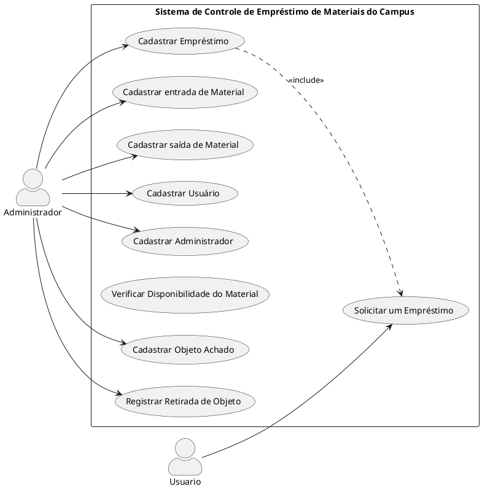

# 📔 Diário de Aula

## 🍙 01/04

### 🎤 Entrevista

> 📝 Cooperar com a formação dos alunos;  
> 🗂️ Organização é pra racionalizar as tarefas;  
> 📑 Formulário de controle;  
> 📚 Empréstimo de materias que possibilita o fator de formação de qualidade;  
> 💬 Orienta os alunos por meio de fichário e diálogos;  
> 📜 Regulamento;

#### ❓ Perguntas:

1. 🔄 A saida e entrada é diretamente pelo aluno e professor?  
   ✅ Sim.
2. 💻 Existe um controle virtual?  
   ✅ Sim, às vezes.
3. 🆔 Não tem id de identificação, por quê?  
   📦 Material de consumo próprio, sua usuabilidade é curto.
4. 📦 Tipos de materiais:  
   A maioria.
5. 📈 FLuxo de entrada e saída de alunos...
6. 🗃️ 3 fichários:  
   1. 🏷️ Achados e Perdidos;  
   2. 🥄 Talheres, materiais esportivos...

## 🎟️ 08/04

### 📌 Organização Prática de Requisitos

#### 🎯 Objetivo

> Organizar e refinar requisitos garantindo rastreabilidade


### 🔍 Fase 01 - Rastrear
* 🔖 Código identificador de requisitos:

  - `LRP000` - requisito principal
  - `LRE000` - requisito específico

> Fase 01: Como deixar rastreável?
> Identificação e decomposição.

### Fase 02 e 03: 
 - Identificar de que forma os requisitos se diferem e especificar conforme as necessidades.
### Fase 04: 
 - Identificar os atores: classificar os usuários.
### Fase 05: 
- Funcionalidades necessárias após os requisitos forem definidos.
### Fase 06: 
- Deixar aberto a entrada de novas funcionalidades fora do escopo inicial, pois podem ter prioridades diferentes.
### Fase 07: 
- Validar e verificar.

### Estudo de Caso em equipe

```
[LRP001] Realizar a gestão de materiais emprestados pelo IFPR.
    [LRE001] Pemitir que os administradores tenham acesso ao controle de entrada de materiais novos (administradtor).
        [AR01-001] Que se adeque quando é produto com ID governamental ou não.
    [LRE002] Pemitir que os administradores tenham acesso ao controle de saída de materiais.
    [LRE003] Pemitir que os administradores tenham acesso Chefe para editar, adicionar ou remover materiais.
    [LRE004] Pemitir que os administradores tenham acesso a classificação de materiais.
    [LRE005] Tanto usuário quando adminisrador podem ter acesso ao monitoramento do estado do material.
    [LRE006] Tanto usuário quando adminisrador podem ter acesso ao monitoramento do tempo de empréstimo.
        [AR06 - 001] Caso passe do tempo de empréstimo, emitir um alerta via email ou SMS para a pessoa emprestada.
        [AR06 - 002] Ter um campo para o motivo do atraso.
    [LRE007] Permitir que os administradores façam um encaminhamento de relatórios de materiais danificados para a sessão administradora.
    [LRE008] Permitir que o usuário faça a solicitação do material que deseja.
```

### Documentação

Análse de Requisitos: o que vale é o conhecimento; mais técnico.

* Cadastro: dados
* Entidade: representa um objeto.
* Dependências: quando um ou mais objeto precisam de seus relacionamentos.
* Campos e características.
* Regras de Negócio: definir regras em cada cadastro.
* Requisitos não funcionais: descrições de funcionalidade.
-> Overleaf: formato SBC.

## 🍳 15/04

### Referência: IEEE 830, com o formato simplificado de: ID, descrição, prioridade, origem, critérios de aceitação.

| ID      | Descrição                                          | Prioridade | Origem      | Critérios de Aceitação                                      |
|---------|----------------------------------------------------|------------|-------------|-------------------------------------------------------------|
| REQ-001 | Controle de entrada de materiais novos | Alta       | LRP001 | Pemitir que os administradores tenham acesso ao controle de entrada de materiais novos |

- Utilizamos os dados da aula passada (levantamento de requisitos), para nossa tabela de requisitos, seguindo o padrão utilizado no mercado há algum tempo.
- Nossa base de dados fora, desde o começo, a entrevista com o Edmar, onde fizemos perguntas que pudessem nos auxiliar.
- Focando em rastreabilidade, focamos em ter coerência e coesão, sempre seguindo o padrão.

# ☕ 22/04

### 📊 Diagrama de Classes - UML
#### UML: estrutura e comportamento.
 * Estrutural: diagrama de classes; técnico; valioso pro programador
 * Comportamental: mais próximo do usuário; validar
   -> documentação precisa ser enchuto.

```
@startuml
skinparam actorPosition top 
left to right direction 

actor "Cliente" as Cliente
actor "Administrador" as Administrador
actor "Vendedor" as Funcionário


rectangle "Sistema de Reserva de Quadra" {
  usecase "Consultar calendário" as C01
  usecase "Buscar reserva" as C02
  usecase "Realizar reserva" as C03
  usecase "Verificar disponibilidade" as C04
  usecase "Cancelar reserva" as C05
  usecase "Gerenciar todas reservas" as C06
  usecase "Manutenção da quadra" as C07 

  usecase "Consulta de vendas e reservas" as C08
  usecase "Notificar reserva" as C09

}

C07 .> C04 : <<include>>
C05 <. C02 : <<extend>>

C04 <. C02 : <<extend>>
C05 .> C03 : <<include>>


Cliente --> C01
Cliente --> C02
Cliente --> C03
Cliente --> C04
Cliente --> C05
Cliente --> C09

Administrador --> C06
Administrador --> C07

Funcionário --|> Cliente
Administrador --|> Cliente

Funcionário --> C08

@enduml

```

### 🧨 Tabela de Rastreamente e Requisitos Func., Não Func e Reg. Négocio: 
[https://docs.google.com/spreadsheets/d/1USDxUKdwEfHJNFCXCWACJYU2qvuVpbquJO1noDsW5ug/edit?gid=0#gid=0]
#### 🚨 Código de Caso de Uso da tabela ^ :
```
@startuml
skinparam actorPosition top 
skinparam actorStyle awesome
left to right direction


actor "Administrador" as adm
actor "Funcionário" as fnc
actor "Usuário" as usu

rectangle "LRP001 - Controle de empréstimos de materiais" {
    package "Acesso" {
        usecase "Leitura de credenciais para acesso" as RF001
        usecase "Permissão de acesso chefe" as RF005
    }

    package "Gestão" {
        usecase "Classificação de estado de conservação" as RF004
        usecase "Restrição de entrada de novos materiais" as RF002
        usecase "Classificação de Materiais" as RF003
    }
    package "Empréstimo" {
        usecase "Controle de horas" as RF006
        usecase "Solicitação de empréstimo" as RF007
        usecase "Controle de saída de materiais" as RF008
        usecase "Controle de lista de empréstimo" as RF009
        usecase "Registro de status de empréstimo" as RF010
    }
}
 

adm --|> fnc
adm --|> usu

adm --> RF004
adm --> RF005
adm --> RF006

fnc --> RF002
fnc --> RF003
fnc --> RF008
fnc --> RF009
fnc --> RF010

usu --> RF001
usu --> RF007

RF008 .> RF007 : <<include>>  
RF001 .> RF005 : <<include>>  

RF010 .> RF009 : <<extend>>   
RF007 .> RF006 : <<extend>>   
RF003 .> RF002 : <<extend>>


@enduml
```
# AULA - 06/05/2025

## Atividade em Grupo  
### Tema: Sistema de Controle de Empréstimo de Materiais  
- Melhorar o diagrama de casos de uso com base no feedback do professor  
- Revisar e organizar os requisitos levantados na aula anterior  
- Discutir sobre *funcionalidades principais* e *relacionamentos entre os elementos*  

## Melhorias com auxílio do professor  
- Inclusão do relacionamento *include* entre "Cadastrar Empréstimo" e "Solicitar um Empréstimo"  
- Reorganização dos casos de uso relacionados a *achados e perdidos*  
- Padronização dos nomes e agrupamento dos atores  
- Verificação de *ações exclusivas do administrador* e do *usuário comum*

## Diagrama de Casos de Uso (PlantUML)


## 📋 Levantamento de Requisitos

### 🔹 [LRP001] Realizar o controle de empréstimo de materiais  
#### 🔸 [LRE001] Permitir que o responsável realize o registro de entrada e saída de materiais de uso coletivo do campus  
- *[AR01-001] Cadastro de Administrador*  
  - Campos: \*E-mail, \*Senha, \*Nome  
- *[AR01-003] Cadastro de material*  
  - Campos: \*ID, Número patrimônio, \*Nome, \*Tipo, local, \*Data entrada  
- *[AR01-004] Quem fez o empréstimo (usuário)*  
  - Campos: \*Nome, \*E-mail  
- *[AR01-005] Cadastro de empréstimo*  
  - Campos: \*ID, \*Material, \*Data saída, \*Data devolução  
  - Relacionamento com:  
    - [AR01-004] (Usuário)  
    - [AR01-003] (Material)  

#### 🔸 [LRE002] Permitir que o responsável realize o controle de entrada e saída de materiais achados e perdidos do campus  
- [AR01-001], [AR01-003]  
- *[AR02-001] Cadastro de Objetos Achados*  
  - Campos: \*Nome, \*Local, \*Data  
- *[AR02-002] Registro de retirada de objeto*  
  - Campos: \*Objeto, \*Responsável pela retirada, \*Data retirada  

> *Nota:* Campos com * são obrigatórios.

## 🗣️ Discussões  
- A separação entre *materiais emprestáveis* e *objetos perdidos* deixou o sistema mais organizado  
- Houve dúvidas sobre como modelar *relacionamentos entre objetos e usuários*, resolvidas com auxílio do professor  
- Reforçamos a importância de *nomes claros* e *agrupamento funcional* dos casos de uso  

## Autoavaliação: *Dev*
