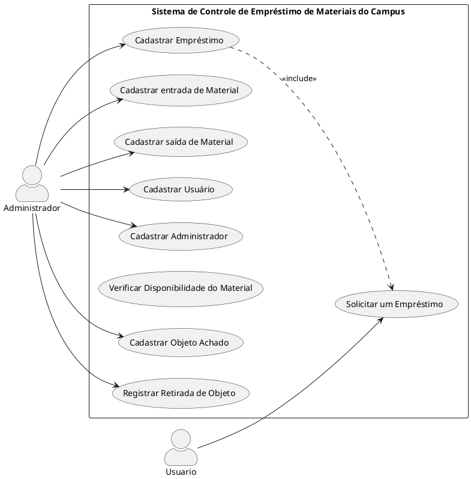

# AULA - 06/05/2025

## Atividade em Grupo  
### Tema: Sistema de Controle de Empréstimo de Materiais  
- Melhorar o diagrama de casos de uso com base no feedback do professor  
- Revisar e organizar os requisitos levantados na aula anterior  
- Discutir sobre *funcionalidades principais* e *relacionamentos entre os elementos*  

## Melhorias com auxílio do professor  
- Inclusão do relacionamento *include* entre "Cadastrar Empréstimo" e "Solicitar um Empréstimo"  
- Reorganização dos casos de uso relacionados a *achados e perdidos*  
- Padronização dos nomes e agrupamento dos atores  
- Verificação de *ações exclusivas do administrador* e do *usuário comum*

## Diagrama de Casos de Uso (PlantUML)

## 📋 Levantamento de Requisitos

### 🔹 [LRP001] Realizar o controle de empréstimo de materiais  
#### 🔸 [LRE001] Permitir que o responsável realize o registro de entrada e saída de materiais de uso coletivo do campus  
- *[AR01-001] Cadastro de Administrador*  
  - Campos: \*E-mail, \*Senha, \*Nome  
- *[AR01-003] Cadastro de material*  
  - Campos: \*ID, Número patrimônio, \*Nome, \*Tipo, local, \*Data entrada  
- *[AR01-004] Quem fez o empréstimo (usuário)*  
  - Campos: \*Nome, \*E-mail  
- *[AR01-005] Cadastro de empréstimo*  
  - Campos: \*ID, \*Material, \*Data saída, \*Data devolução  
  - Relacionamento com:  
    - [AR01-004] (Usuário)  
    - [AR01-003] (Material)  

#### 🔸 [LRE002] Permitir que o responsável realize o controle de entrada e saída de materiais achados e perdidos do campus  
- [AR01-001], [AR01-003]  
- *[AR02-001] Cadastro de Objetos Achados*  
  - Campos: \*Nome, \*Local, \*Data  
- *[AR02-002] Registro de retirada de objeto*  
  - Campos: \*Objeto, \*Responsável pela retirada, \*Data retirada  

> *Nota:* Campos com * são obrigatórios.

## 🗣️ Discussões  
- A separação entre *materiais emprestáveis* e *objetos perdidos* deixou o sistema mais organizado  
- Houve dúvidas sobre como modelar *relacionamentos entre objetos e usuários*, resolvidas com auxílio do professor  
- Reforçamos a importância de *nomes claros* e *agrupamento funcional* dos casos de uso  

## Autoavaliação: *Dev*
